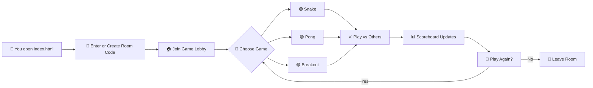

# ╔══════════════════════════════════════════╗
# ║          ▄▄▄▄▄▄▄▄▄▄▄▄▄▄▄▄▄▄▄▄▄▄▄         ║
# ║      ▄▄▀▀▀▀▀▀▀▀▀▀▀▀▀▀▀▀▀▀▀▀▀▀▀▀▀▀▀▀▄▄    ║
# ║    █▀  ┌─┐┌─┐┬─┐┌┬┐┌─┐┬ ┬┬─┐┌─┐┌─┐  ▀█  ║
# ║    █   │ ┬│ │├┬┘ │ │ ││ │├┬┘├─┤├┤   █   ║
# ║    █   └─┘└─┘┴└─ ┴ └─┘└─┘┴└─┴ ┴└    █   ║
# ║    █▄   ▄▄▄▄▄▄▄▄▄▄▄▄▄▄▄▄▄▄▄▄▄▄▄▄▄   ▄█   ║
# ║      ▀▀▀▀▀▀▀▀▀▀▀▀▀▀▀▀▀▀▀▀▀▀▀▀▀▀▀▀▀▀     ║
# ║          ▄▄▄▄▄▄▄▄▄▄▄▄▄▄▄▄▄▄▄▄▄▄▄         ║
# ║          █▀▀ █▀▀ █▀▀█ █▀▄▀█ █▀▀          ║
# ║          █▀▀ ▀▀█ █▄▄█ █─▀─█ █▀▀          ║
# ║          ▀▀▀ ▀▀▀ ▀──▀ ▀───▀ ▀▀▀          ║
# ╚══════════════════════════════════════════╝
#         🎮  G A M E R O O M  v1.0  🎮

[](https://github.com/shubhyagami/gameroom)
[](LICENSE)
[](https://github.com/shubhyagami/gameroom)
[](https://github.com/shubhyagami/gameroom/pulls)
[](https://github.com/shubhyagami/gameroom)

---

## 🚀 What is GameRoom?

**GameRoom** is a fully browser-based multiplayer arcade lounge where you and your friends can drop in, grab a virtual joystick, and battle for the top of the leaderboard — no downloads, no sign‑ups, just pure pixel‑perfect fun.

Think of it as your living room’s old CRT TV, but reimagined for the web. Every game runs on plain HTML, CSS, and JavaScript — so it’s fast, lightweight, and works anywhere with a modern browser.

---

## ✨ Features

- 🕹️ **Classic Arcade Games** – Play retro favorites like Snake, Pong, Breakout, and more.
- 👥 **Multiplayer Rooms** – Create or join a room with a simple code; up to 8 players per room.
- 🏆 **Live Scoreboard** – Every move updates the leaderboard in real time.
- 💬 **In‑Game Chat** – Trash talk your opponents with a built‑in chat panel.
- 🎨 **Customisable Avatars** – Pick from 16‑bit pixel icons or upload your own.
- 📱 **Mobile Ready** – Responsive layout that works on phones, tablets, and desktops.
- 🔌 **No Backend Required** – Uses WebRTC and IndexedDB for peer‑to‑peer communication and local persistence.

---

## 🧠 How It Works



> *Diagram shows the core flow from arrival to leaving.*

---

## 📦 Installation

GameRoom is a static web app – zero build tools required.

### Option 1: Clone & Open

```bash
git clone https://github.com/shubhyagami/gameroom.git
cd gameroom
open index.html        # macOS
# or
xdg-open index.html    # Linux
# or double‑click index.html (Windows)
```

### Option 2: Local Server (Recommended for multiplayer)

```bash
# Using Python
python3 -m http.server 8080
# Then visit http://localhost:8080
```

---

## 🏆 Pro Tips

Get an edge over your opponents with these insider tricks:

### 🐍 Snake
- **Corner camping** – In the late game, stay near walls to force opponents into your tail.
- **Speed burst** – Hold the boost key (spacebar) to dash forward, but beware of your own trail.
- **Power‑up priority** – Grab the **speed‑down** power‑up when you’re leading; it slows everyone else.

### 🏓 Pong
- **Angle your shots** – Hit the ball near the edge of your paddle for a sharper bounce.
- **CPU bait** – Against AI, send the ball high then low – the bot will overcorrect.
- **Serve trick** – Press the serve button at the exact moment the ball flashes to launch it at max speed.

### 🧱 Breakout
- **Catch the bonus** – Let the ball bounce off the very top of the paddle to earn a multiball power‑up.
- **Brick patterns** – Destroy bricks in a zigzag to create chain reactions when the ball ricochets.
- **Laser aim** – If you have the laser upgrade, fire straight up to clear a column in one shot.

---

## 🎯 Weekly Highlight: Speedrun Showdown

This week’s featured challenge: **Breakout – Clear all bricks in under 45 seconds!**  
Post your time in the in‑game chat (room code: **SPEEDRUN**) and the fastest 3 players will get a special pixel trophy added to their avatar.  
*Challenge ends Sunday 23:59 UTC.*

---

## 💬 Motivational Quote

> *“The only way to win is to learn faster than your opponents.”*  
> — *Anonymous Arcade Legend*

---

## 📜 Changelog – 2026‑07‑29

### v1.0.1 (Latest)
- **New** – Added `Pro Tips` section to README (this one!).
- **New** – Weekly Highlight challenges now displayed in the lobby banner.
- **Fixed** – Pong ball clipping through paddle at extreme angles.
- **Fixed** – Snake leaderboard not updating when players tie.
- **Improved** – Mobile touch controls now support swipe gestures for Pong.
- **Improved** – Chat panel auto‑scrolls to newest messages.

---

## 🤝 Contributing

GameRoom is open source and we love contributions!  
Check out the [CONTRIBUTING.md](CONTRIBUTING.md) for guidelines.  
Feel free to open issues for bugs or feature requests, or submit a PR with your own arcade game addition.

---

## 📄 License

This project is licensed under the MIT License – see the [LICENSE](LICENSE) file for details.

---

> *GameRoom – Where every pixel has a story.*