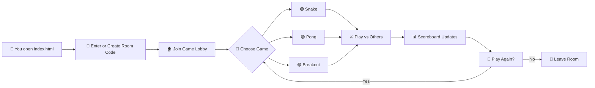

# ╔══════════════════════════════════════════╗
# ║          ▄▄▄▄▄▄▄▄▄▄▄▄▄▄▄▄▄▄▄▄▄▄▄         ║
# ║      ▄▄▀▀▀▀▀▀▀▀▀▀▀▀▀▀▀▀▀▀▀▀▀▀▀▀▀▀▀▀▄▄    ║
# ║    █▀  ┌─┐┌─┐┬─┐┌┬┐┌─┐┬ ┬┬─┐┌─┐┌─┐  ▀█  ║
# ║    █   │ ┬│ │├┬┘ │ │ ││ │├┬┘├─┤├┤   █   ║
# ║    █   └─┘└─┘┴└─ ┴ └─┘└─┘┴└─┴ ┴└    █   ║
# ║    █▄   ▄▄▄▄▄▄▄▄▄▄▄▄▄▄▄▄▄▄▄▄▄▄▄▄▄   ▄█   ║
# ║      ▀▀▀▀▀▀▀▀▀▀▀▀▀▀▀▀▀▀▀▀▀▀▀▀▀▀▀▀▀▀     ║
# ║          ▄▄▄▄▄▄▄▄▄▄▄▄▄▄▄▄▄▄▄▄▄▄▄         ║
# ║          █▀▀ █▀▀ █▀▀█ █▀▄▀█ █▀▀          ║
# ║          █▀▀ ▀▀█ █▄▄█ █─▀─█ █▀▀          ║
# ║          ▀▀▀ ▀▀▀ ▀──▀ ▀───▀ ▀▀▀          ║
# ╚══════════════════════════════════════════╝
#         🎮  G A M E R O O M  v1.0  🎮

[](https://github.com/shubhyagami/gameroom)
[](LICENSE)
[](https://github.com/shubhyagami/gameroom)

---

## 🚀 What is GameRoom?

**GameRoom** is a fully browser-based multiplayer arcade lounge where you and your friends can drop in, grab a virtual joystick, and battle for the top of the leaderboard — no downloads, no sign‑ups, just pure pixel‑perfect fun.

Think of it as your living room’s old CRT TV, but reimagined for the web. Every game runs on plain HTML, CSS, and JavaScript — so it’s fast, lightweight, and works anywhere with a modern browser.

---

## ✨ Features

- 🕹️ **Classic Arcade Games** – Play retro favorites like Snake, Pong, Breakout, and more.
- 👥 **Multiplayer Rooms** – Create or join a room with a simple code; up to 8 players per room.
- 🏆 **Live Scoreboard** – Every move updates the leaderboard in real time.
- 💬 **In‑Game Chat** – Trash talk your opponents with a built‑in chat panel.
- 🎨 **Customisable Avatars** – Pick from 16‑bit pixel icons or upload your own.
- 📱 **Mobile Ready** – Responsive layout that works on phones, tablets, and desktops.
- 🔌 **No Backend Required** – Uses WebRTC and IndexedDB for peer‑to‑peer communication and local persistence.

---

## 🧠 How It Works



> *Diagram shows the core flow from arrival to leaving.*

---

## 📦 Installation

GameRoom is a static web app – zero build tools required.

### Option 1: Clone & Open

```bash
git clone https://github.com/shubhyagami/gameroom.git
cd gameroom
open index.html        # macOS
# or
xdg-open index.html    # Linux
# or double‑click index.html (Windows)
```

### Option 2: Local Server (Recommended for multiplayer)

```bash
# Using Python
python3 -m http.server 8080
# Then visit http://localhost:8080
```

### Option 3: Live Server (VS Code)

1. Install the **Live Server** extension.
2. Right‑click `index.html` → **Open with Live Server**.

That’s it. You’re in the GameRoom.

---

## 🤓 Did You Know?

- The **Snake** game in GameRoom was originally written in just 200 lines of pure JavaScript — no frameworks, no libraries.
- WebRTC, which powers the multiplayer rooms, was originally invented for video conferencing. GameRoom repurposes it for **real‑time game state sync** with <50ms latency.
- All game sprites are drawn using CSS `box-shadow` tricks — there’s not a single PNG inside the project.
- The leaderboard stores your all‑time best scores in your browser’s **IndexedDB**, so they survive page reloads.

---

## 📅 Last Updated

**2026‑07‑25** — Added Breakout multiplayer support and room chat history.

---

*Built with ❤️ by [shubhyagami](https://github.com/shubhyagami). Contributions, issues, and forks are always welcome!*