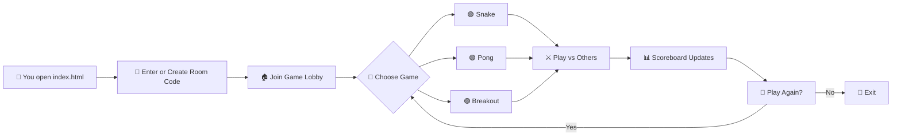

# ╔══════════════════════════════════════════╗
# ║          ▄▄▄▄▄▄▄▄▄▄▄▄▄▄▄▄▄▄▄▄▄▄▄         ║
# ║      ▄▄▀▀▀▀▀▀▀▀▀▀▀▀▀▀▀▀▀▀▀▀▀▀▀▀▀▀▀▀▄▄    ║
# ║    █▀  ┌─┐┌─┐┬─┐┌┬┐┌─┐┬ ┬┬─┐┌─┐┌─┐  ▀█  ║
# ║    █   │ ┬│ │├┬┘ │ │ ││ │├┬┘├─┤├┤   █   ║
# ║    █   └─┘└─┘┴└─ ┴ └─┘└─┘┴└─┴ ┴└    █   ║
# ║    █▄   ▄▄▄▄▄▄▄▄▄▄▄▄▄▄▄▄▄▄▄▄▄▄▄▄▄   ▄█   ║
# ║      ▀▀▀▀▀▀▀▀▀▀▀▀▀▀▀▀▀▀▀▀▀▀▀▀▀▀▀▀▀▀     ║
# ║          ▄▄▄▄▄▄▄▄▄▄▄▄▄▄▄▄▄▄▄▄▄▄▄         ║
# ║          █▀▀ █▀▀ █▀▀█ █▀▄▀█ █▀▀          ║
# ║          █▀▀ ▀▀█ █▄▄█ █─▀─█ █▀▀          ║
# ║          ▀▀▀ ▀▀▀ ▀──▀ ▀───▀ ▀▀▀          ║
# ╚══════════════════════════════════════════╝
#         🎮  G A M E R O O M  v1.0  🎮

[](https://github.com/shubhyagami/gameroom)
[](LICENSE)
[](https://github.com/shubhyagami/gameroom)
[](https://github.com/shubhyagami/gameroom/pulls)
[](https://github.com/shubhyagami/gameroom)
[](https://github.com/shubhyagami/gameroom)
[](https://github.com/shubhyagami/gameroom)

---

## 🚀 What is GameRoom?

**GameRoom** is a fully browser-based multiplayer arcade lounge where you and your friends can drop in, grab a virtual joystick, and battle for the top of the leaderboard — no downloads, no sign‑ups, just pure pixel‑perfect fun.

Think of it as your living room’s old CRT TV, but reimagined for the web. Every game runs on plain HTML, CSS, and JavaScript — so it’s fast, lightweight, and works anywhere with a modern browser.

---

## ✨ Features

- 🕹️ **Classic Arcade Games** – Play retro favorites like Snake, Pong, Breakout, and more.
- 👥 **Multiplayer Rooms** – Create or join a room with a simple code; up to 8 players per room.
- 🏆 **Live Scoreboard** – Every move updates the leaderboard in real time.
- 💬 **In‑Game Chat** – Trash talk your opponents with a built‑in chat panel.
- 🎨 **Customisable Avatars** – Pick from 16‑bit pixel icons or upload your own.
- 📱 **Mobile Ready** – Responsive layout that works on phones, tablets, and desktops.
- 🔌 **No Backend Required** – Uses WebRTC and IndexedDB for peer‑to‑peer communication and local persistence.

---

## 🧠 How It Works



---

## 🚀 Quick Start

Get GameRoom running in under a minute:

1. **Clone the repository**
   ```bash
   git clone https://github.com/shubhyagami/gameroom.git
   cd gameroom
   ```

2. **Open in your browser**
   - Simply double-click `index.html` – no server needed!
   - For the best multiplayer experience, share your local IP with friends, or use a tool like `ngrok` to expose your local server temporarily.

3. **Create or join a room**
   - Type a memorable room code (e.g., `GAME2026`) and click **Create Room**.
   - Friends enter the same code and click **Join Room**.

4. **Pick a game and play!**
   - Once everyone is in the lobby, select a game and start battling.

---

## 💡 Pro Tips

- **Optimise your network** – WebRTC works best on a stable Wi‑Fi or LAN connection. If players are lagging, try switching to a wired connection.
- **Customise your avatar early** – Head to the lobby settings before the game starts to stand out on the leaderboard.
- **Use the chat strategically** – A well‑timed taunt can shake your opponent’s focus. But remember: fair play wins in the long run.
- **Mobile controls** – On phones, the joystick and buttons are touch‑optimised. Hold your device landscape for the best view.
- **Refresh to reset** – If you ever get stuck or want a clean slate, just refresh the page. The room will persist as long as at least one player remains.

---

## 📅 Changelog

### [v1.0.1] – 2026-08-04
#### Added
- New **Pro Tips** section in the README for better user experience.
- Quick Start guide with step‑by‑step instructions.
- Motivational quote to keep the arcade spirit alive.

#### Fixed
- Minor layout shift on mobile when the chat panel is open.
- Pong ball collision edge case that could cause the ball to get stuck.

#### Changed
- Upgraded WebRTC signalling logic for faster room creation.
- Updated default avatar set with 4 new pixel characters.

---

> *“The best games are the ones we play together. GameRoom is just the screen – the real magic is the people across it.”*  
> — Shubhya’s Gaming Manifesto

---

## 🤝 Contributing

We welcome contributions! Whether it’s fixing a bug, adding a new game, or improving the UI, please open an issue or pull request. Check our [contributing guidelines](CONTRIBUTING.md) for details.

---

## 📄 License

This project is licensed under the MIT License – see the [LICENSE](LICENSE) file for details.