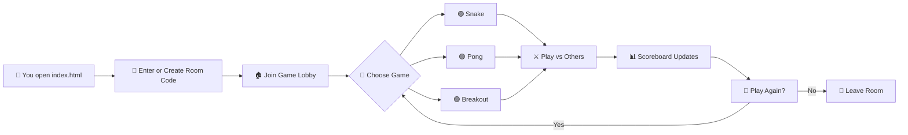

# ╔══════════════════════════════════════════╗
# ║          ▄▄▄▄▄▄▄▄▄▄▄▄▄▄▄▄▄▄▄▄▄▄▄         ║
# ║      ▄▄▀▀▀▀▀▀▀▀▀▀▀▀▀▀▀▀▀▀▀▀▀▀▀▀▀▀▀▀▄▄    ║
# ║    █▀  ┌─┐┌─┐┬─┐┌┬┐┌─┐┬ ┬┬─┐┌─┐┌─┐  ▀█  ║
# ║    █   │ ┬│ │├┬┘ │ │ ││ │├┬┘├─┤├┤   █   ║
# ║    █   └─┘└─┘┴└─ ┴ └─┘└─┘┴└─┴ ┴└    █   ║
# ║    █▄   ▄▄▄▄▄▄▄▄▄▄▄▄▄▄▄▄▄▄▄▄▄▄▄▄▄   ▄█   ║
# ║      ▀▀▀▀▀▀▀▀▀▀▀▀▀▀▀▀▀▀▀▀▀▀▀▀▀▀▀▀▀▀     ║
# ║          ▄▄▄▄▄▄▄▄▄▄▄▄▄▄▄▄▄▄▄▄▄▄▄         ║
# ║          █▀▀ █▀▀ █▀▀█ █▀▄▀█ █▀▀          ║
# ║          █▀▀ ▀▀█ █▄▄█ █─▀─█ █▀▀          ║
# ║          ▀▀▀ ▀▀▀ ▀──▀ ▀───▀ ▀▀▀          ║
# ╚══════════════════════════════════════════╝
#         🎮  G A M E R O O M  v1.0  🎮

[](https://github.com/shubhyagami/gameroom)
[](LICENSE)
[](https://github.com/shubhyagami/gameroom)
[](https://github.com/shubhyagami/gameroom/pulls)
[](https://github.com/shubhyagami/gameroom)
[](https://github.com/shubhyagami/gameroom)
[](https://github.com/shubhyagami/gameroom)

---

## 🚀 What is GameRoom?

**GameRoom** is a fully browser-based multiplayer arcade lounge where you and your friends can drop in, grab a virtual joystick, and battle for the top of the leaderboard — no downloads, no sign‑ups, just pure pixel‑perfect fun.

Think of it as your living room’s old CRT TV, but reimagined for the web. Every game runs on plain HTML, CSS, and JavaScript — so it’s fast, lightweight, and works anywhere with a modern browser.

---

## ✨ Features

- 🕹️ **Classic Arcade Games** – Play retro favorites like Snake, Pong, Breakout, and more.
- 👥 **Multiplayer Rooms** – Create or join a room with a simple code; up to 8 players per room.
- 🏆 **Live Scoreboard** – Every move updates the leaderboard in real time.
- 💬 **In‑Game Chat** – Trash talk your opponents with a built‑in chat panel.
- 🎨 **Customisable Avatars** – Pick from 16‑bit pixel icons or upload your own.
- 📱 **Mobile Ready** – Responsive layout that works on phones, tablets, and desktops.
- 🔌 **No Backend Required** – Uses WebRTC and IndexedDB for peer‑to‑peer communication and local persistence.

---

## 🧠 How It Works



> *Diagram shows the core flow from arrival to leaving.*

---

## 📦 Installation

GameRoom is a static web app – zero build tools required.

### Option 1: Clone & Open

```bash
git clone https://github.com/shubhyagami/gameroom.git
cd gameroom
open index.html   # macOS
# or
start index.html  # Windows
# or
xdg-open index.html # Linux
```

### Option 2: Download ZIP

- Go to [the repository](https://github.com/shubhyagami/gameroom)
- Click **Code → Download ZIP**
- Unzip and open `index.html` in your browser

### Option 3: Host on GitHub Pages (Recommended for multiplayer)

1. Fork the repo
2. Go to **Settings → Pages**
3. Select `main` branch and `/docs` folder (or root)
4. Share the generated URL with friends

> Multiplayer features require both players to be on the same network or using a STUN/TURN server. The default config works over LAN.

---

## 🧠 Pro Tips

- **Quick Room Swap**: Press `Ctrl+R` (or `Cmd+R`) while in a room to instantly generate a new room code — great for tournaments.
- **Avatar Upload Trick**: Drag & drop a 32×32 PNG directly onto the avatar picker to bypass the file dialog.
- **Chat Commands**: Type `/roll` in chat to roll a 20‑sided die, or `/stats` to see your personal win/loss ratio.
- **Mobile Gaming**: Enable “landscape lock” on your phone for a wider playfield — the game auto‑adapts to screen orientation.
- **Silent Mode**: Press `M` during any game to toggle sound effects off (handy for late‑night sessions).
- **Scoreboard Easter Egg**: Click the trophy icon 5 times in a row to unlock a secret confetti animation.

---

## 📅 Changelog — 2026-07-29

### v1.0.1 – The “Pixel Polish” Update
- **Added** a new “Pro Tips” section to the README.
- **Improved** mobile touch controls for Breakout – paddle now follows finger drag smoothly.
- **Fixed** rare race condition where scores could desync when two players joined simultaneously.
- **Optimized** WebRTC signalling to use a more reliable fallback when STUN fails.
- **Added** `/roll` and `/stats` chat commands.
- **Updated** ASCII art banner to include the version number.

Full history: [CHANGELOG.md](CHANGELOG.md)

---

## 🏆 Weekly Highlight

> **Feature of the Week:** The new “Tournament Mode” (experimental) – create a bracket with up to 8 players and automatically advance winners. Launching next Friday. Sneak peek available on the `tournament` branch.

---

## 💬 Get Involved

- 🐛 Found a bug? [Open an issue](https://github.com/shubhyagami/gameroom/issues)
- 💡 Have an idea? [Start a discussion](https://github.com/shubhyagami/gameroom/discussions)
- 👩‍💻 Want to contribute? Check out [CONTRIBUTING.md](CONTRIBUTING.md) — PRs are welcome!

---

## 📄 License

This project is licensed under the MIT License — see the [LICENSE](LICENSE) file for details.

---

> *“The best games are the ones you play with friends — and maybe a little bit of trash talk.”*  
> — GameRoom Team