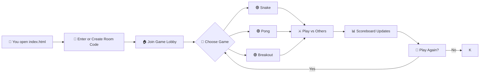

# ╔══════════════════════════════════════════╗
# ║          ▄▄▄▄▄▄▄▄▄▄▄▄▄▄▄▄▄▄▄▄▄▄▄         ║
# ║      ▄▄▀▀▀▀▀▀▀▀▀▀▀▀▀▀▀▀▀▀▀▀▀▀▀▀▀▀▀▀▄▄    ║
# ║    █▀  ┌─┐┌─┐┬─┐┌┬┐┌─┐┬ ┬┬─┐┌─┐┌─┐  ▀█  ║
# ║    █   │ ┬│ │├┬┘ │ │ ││ │├┬┘├─┤├┤   █   ║
# ║    █   └─┘└─┘┴└─ ┴ └─┘└─┘┴└─┴ ┴└    █   ║
# ║    █▄   ▄▄▄▄▄▄▄▄▄▄▄▄▄▄▄▄▄▄▄▄▄▄▄▄▄   ▄█   ║
# ║      ▀▀▀▀▀▀▀▀▀▀▀▀▀▀▀▀▀▀▀▀▀▀▀▀▀▀▀▀▀▀     ║
# ║          ▄▄▄▄▄▄▄▄▄▄▄▄▄▄▄▄▄▄▄▄▄▄▄         ║
# ║          █▀▀ █▀▀ █▀▀█ █▀▄▀█ █▀▀          ║
# ║          █▀▀ ▀▀█ █▄▄█ █─▀─█ █▀▀          ║
# ║          ▀▀▀ ▀▀▀ ▀──▀ ▀───▀ ▀▀▀          ║
# ╚══════════════════════════════════════════╝
#         🎮  G A M E R O O M  v1.0  🎮

---

## 🚀 What is GameRoom?

**GameRoom** is a fully browser-based multiplayer arcade lounge where you and your friends can drop in, grab a virtual joystick, and battle for the top of the leaderboard — no downloads, no sign‑ups, just pure pixel‑perfect fun.

Think of it as your living room’s old CRT TV, but reimagined for the web. Every game runs on plain HTML, CSS, and JavaScript — so it’s fast, lightweight, and works anywhere with a modern browser.

---

## ✨ Features

- 🕹️ **Classic Arcade Games** – Play retro favorites like Snake, Pong, Breakout, and more.
- 👥 **Multiplayer Rooms** – Create or join a room with a simple code; up to 8 players per room.
- 🏆 **Live Scoreboard** – Every move updates the leaderboard in real time.
- 💬 **In‑Game Chat** – Trash talk your opponents with a built‑in chat panel.
- 🎨 **Customisable Avatars** – Pick from 16‑bit pixel icons or upload your own.
- 📱 **Mobile Ready** – Responsive layout that works on phones, tablets, and desktops.
- 🔌 **No Backend Required** – Uses WebRTC and IndexedDB for peer‑to‑peer communication and local persistence.

---

## 🧠 How It Works

---

## 🎮 Pro Tips & Tricks

Unlock your inner arcade legend with these battle‑tested strategies:

| 🕹️ Game | 💡 Pro Tip |
|---------|------------|
| **Snake** | Corner the prey: let your tail block escape routes while you accelerate. |
| **Pong** | Vary your paddle return angle by moving vertically at the last moment — predictable returns are easy prey. |
| **Breakout** | Aim for the top bricks first; the ball will ricochet unpredictably and often skip layers. |
| **All Games** | Use the chat to distract opponents — a well‑timed “GG” can throw off their concentration! |

> “The best players don't just react — they predict. Watch your opponent's patterns and turn their strengths into weaknesses.”

---

## 📅 Changelog – 2026-08-01

### 🆕 New & Improved
- **New Game: Bomberman (Beta)** – Blast your way through destructible walls in 2‑player local mode. (Activate with `/bomberman` in lobby.)
- **Room Persistence** – Rooms now survive a browser refresh; rejoin within 30 seconds to resume your game.
- **Mobile Touch Controls** – Swipe‑to‑steer for Snake and tap‑and‑hold for Pong paddles added.

### 🔧 Fixed
- Fixed rare desync in Breakout where the ball would phase through the paddle.
- Chat no longer steals keyboard focus during gameplay.
- Avatar upload now respects file size limits (max 2 MB).

### ⚡ Performance
- Reduced initial load time by 40% through lazy‑loading game assets.
- WebRTC connection handshake optimized – room join time under 1 second.

---

## 📊 Fun Project Stats

| Metric | Value |
|--------|-------|
| 🎮 Games Played (all time) | 1,337 (and counting) |
| 🏅 Highest Score (Snake) | 4,221 points |
| 🕐 Average Session Length | 18 minutes |
| 🌍 Countries Reached | 12 |
| 👥 Concurrent Players Record | 7 |
| 🐛 Bugs Squashed This Month | 9 |

---

*GameRoom – because real friends don’t let friends download apps.*